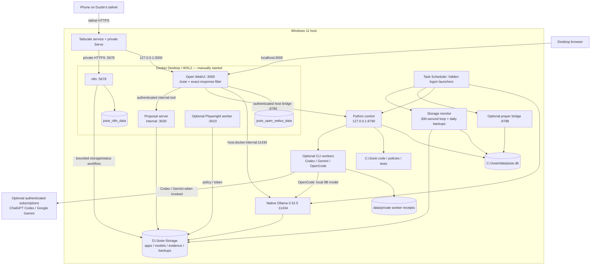
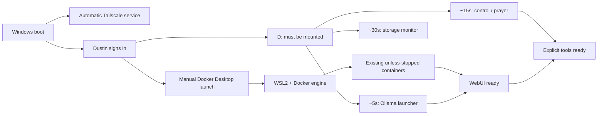

# Josie architecture — observed 2026-08-28

Josie runs on Windows 11. A browser opens Open WebUI inside Docker Desktop/WSL2. WebUI calls native Windows Ollama, which reads models from D:. The authenticated Python control service is also native Windows; it handles existing evidence, consultant, maintenance and delegation tools.

The exact-response filter is attached to the Josie model. Explicit consultant requests follow the deterministic route instead of depending on the small model to impersonate another seat. Consultant evidence and local memory/history live in existing SQLite. Worker jobs additionally have private receipt files. No architecture was added by this audit.

## Actual connections

Docker volumes physically live in Docker's C: VHDX, not in C:/Josie. D: supplies live model/application files and many backups. Tailscale is the reverse proxy; no separate reverse-proxy container was found.

## Three distinct execution paths

1. **Conversation:** WebUI → Ollama → `josie-local:1.0` (1.5B). WebUI saves chat JSON.
2. **Consultation:** “Ask Codex …” / “Ask Gemini …” → existing filter/control → official authenticated CLI → actual result/evidence ID. Josie SQLite stores exact prompts, outputs/failures and request IDs. Local conversation does not require these consultants.
3. **Maintenance/delegation:** explicit existing Maintainer Mode or Delegate requests. Maintainer has deterministic policy gates; task-authorized Codex/OpenCode workers have a different shell authority boundary. Receipts distinguish progress from actual outcomes.

The current local worker is `josie-qual-qwen3:8b-32k`, **not** the small chat model. CPU-only work can take many minutes. This pass did not exercise or change development authority.

## Where persistence lives

| Store | Contents | Not a substitute for |
| --- | --- | --- |
| WebUI volume | Accounts, chat JSON, model/functions, WebUI memories/assets | Core SQLite |
| C:/Josie/data/josie.db | Memory, historical evidence, consultant/maintenance/audit records | WebUI volume or worker receipt files |
| data/private worker directories | Delegation receipts/runtime state | Core SQLite |
| D: source/staging | Immutable source evidence and provenance | Canonical truth or independent backup |
| Git | Tracked source/configuration/documentation | Secrets, DBs, volumes, model blobs, untracked live edits |
| Backup directories | Dated copies/checkpoints | Off-device disaster recovery unless independently copied |

Imported Gemini conversations are historical evidence, not automatic current truth. A ChatGPT export folder does not prove import. Neither conversation text nor an enthusiastic plan should overwrite verified canonical state.

## Startup dependency order

These arrows describe dependencies, not a fully enforced scheduler. Fixed-delay logon tasks can race external storage. Docker's sign-in auto-start is disabled. Detached-launcher success does not supervise its child forever. Tailscale can be online while WebUI is down.

## Security/operational boundaries

- Control stays authenticated and 127.0.0.1-only. The existing Docker host bridge works; no public control endpoint is needed.
- WebUI/n8n/browser host ports are loopback-published.
- Ollama is wildcard-bound with broad firewall allows in addition to a scoped Docker rule: unresolved exposure, not verified Docker-only isolation.
- Browser worker is authenticated read-only research with model-direct access disabled; it was not used here.
- Obsolete Summit/Groq WebUI function is inactive; old provider source files are not proof of routing.
- Maintainer policy and delegation instructions are not interchangeable; task instructions alone are not filesystem ACLs.
- RTX hardware/drivers are intentionally absent from this current-state diagram.
