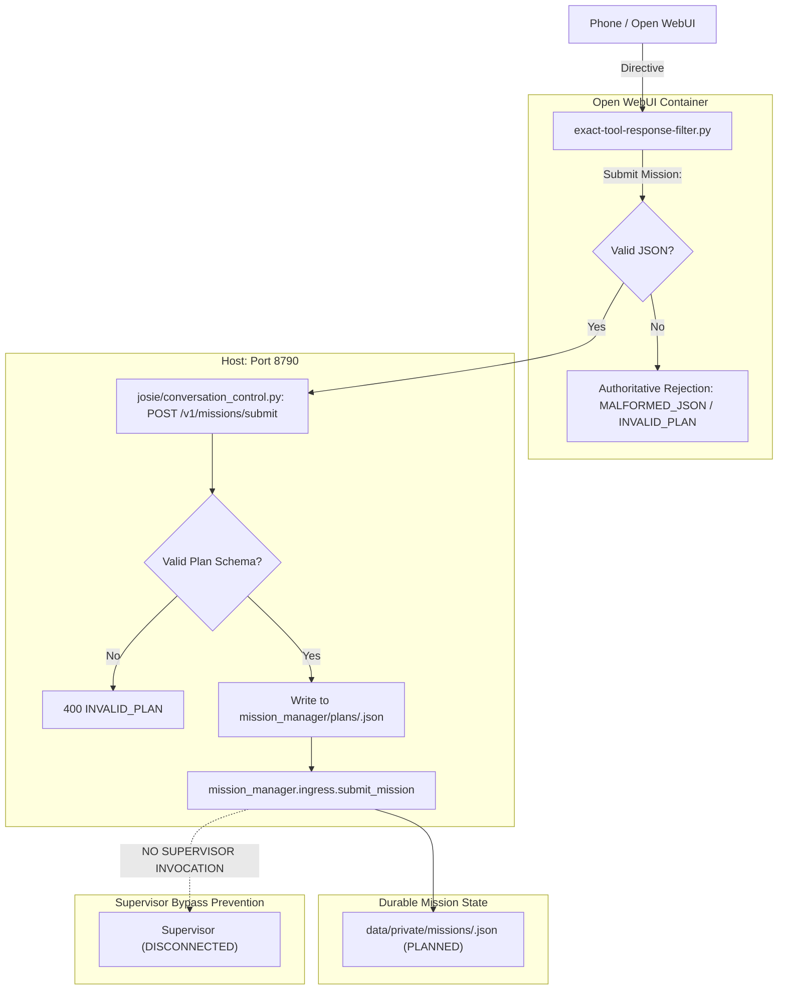

# 10 REMOTE MISSION SUBMISSION BRIDGE REPORT

- **Gate Name:** REMOTE_MISSION_SUBMISSION_BRIDGE
- **Target Subsystem:** Josie Remote Front-Door Intake / Conversation Control / Open WebUI Filter / Mission Manager Ingress
- **Timestamp:** 2026-09-14T23:35:00Z
- **Repository Root:** `D:\Josie`
- **Environment:** Windows 10/11, Python `D:\Josie\.venv\Scripts\python.exe`
- **Files Modified:**
  - `D:\Josie\deploy\open-webui\exact-tool-response-filter.py`
  - `D:\Josie\josie\conversation_control.py`
  - `D:\Josie\tests\test_mission_frontdoor.py`
- **Services Verified:** Conversation Control (`http://127.0.0.1:8790`), Open WebUI Container (`josie-open-webui-1`)
- **Status:** **PASS**

---

## 1. Executive Summary

This qualification gate establishes and verifies the final missing front-door bridge required for **Josie Remote Autonomous Mission Intake**. 

Previously, remote users could check mission status (`Mission Status: <id>`) or continue/resume an existing mission (`Continue Mission: <id>`) via Open WebUI on a phone, but there was no phone-accessible directive or HTTP endpoint to submit a brand new Mission Manager plan.

With this implementation:
1. Dustin can submit a complete mission plan from Open WebUI on his phone using:
   ```text
   Submit Mission:
   <json plan>
   ```
2. The Open WebUI exact filter intercepts this directive, validates JSON structure, and dispatches to `POST /v1/missions/submit` on conversation control (port 8790).
3. Conversation control validates the plan schema and routes cleanly to the canonical Mission Manager ingress (`submit_mission` in `mission_manager/ingress.py`), persisting durable state in `data/private/missions/<mission_id>.json`.
4. The mission enters `PLANNED` state without premature supervisor dispatch.
5. Anti-bypass guarantees are strictly upheld: Supervisor is **never** invoked directly, legacy `Delegate Local:` directives remain isolated and functional, and malformed plans are authoritatively rejected before touching Mission Manager state.

---

## 2. Remote Directives Contract

The phone-accessible Open WebUI front door now supports the complete Mission Manager lifecycle:

| Action | Phone Directive Syntax | Backend HTTP Endpoint | Target Handler |
|---|---|---|---|
| **Submit Mission** | `Submit Mission:\n<json plan>` | `POST /v1/missions/submit` | `mission_manager.ingress.submit_mission` |
| **Mission Status** | `Mission Status: <mission_id>` | `POST /v1/missions/status` | `mission_manager.ingress.mission_status` |
| **Continue Mission** | `Continue Mission: <mission_id>` | `POST /v1/missions/continue` | `mission_manager.ingress.continue_mission` |

### Legacy Delegation Isolation
- `Delegate Local: <task>` remains completely independent and continues routing directly to `POST /v1/delegate-local` for immediate supervisor tasks, preserving backward compatibility.

---

## 3. Architecture & Anti-Bypass Guarantees



### Strict Verification of Anti-Bypass Constraints
- **Canonical Entry Point:** Intake must execute `submit_mission(plan, project_root=project_root)` in `mission_manager/ingress.py`.
- **Durable State:** The mission is written to `data/private/missions/<mission_id>.json` with status `PLANNED`.
- **Zero Supervisor Execution:** Intake only stages the mission. No worker execution or supervisor work orders are triggered until an explicit `continue` call or directive is issued.
- **Malformed Input Protection:** Malformed JSON or schemas missing required fields (`mission_id`, `title`, `objective`, `jobs`) are rejected with explicit failure reasons, preventing partial writes or corrupt durable files.

---

## 4. Implementation Details

### A. Open WebUI Filter (`D:\Josie\deploy\open-webui\exact-tool-response-filter.py`)
- Added `MISSION_SUBMIT` regex: `re.compile(r"\A\s*Submit\s+Mission\s*:\s*(.*)\Z", re.I | re.DOTALL)`.
- Updated `_mission_directive` to extract and validate JSON body for submit operations:
  - If valid JSON: returns `("submit", parsed_dict, None)`
  - If malformed JSON: returns `("malformed_json", None, None)`
  - If not a dictionary: returns `("invalid_plan", None, None)`
- Updated `_dispatch_mission_ingress` to route `"submit"` to `/v1/missions/submit` with payload `{"request_id": request_id, "plan": target}`.
- Added authoritative error responses for `malformed_json` and `invalid_plan` to provide clear feedback to the user without calling backend endpoints.
- Deployed update into live Docker container `josie-open-webui-1` via `deploy/open-webui/install-delegation-filter.py`.

### B. Conversation Control (`D:\Josie\josie\conversation_control.py`)
- Added `POST /v1/missions/submit` endpoint in `ConversationControlHandler.do_POST`.
- Implements strict validation of `raw_plan` dict and `mission_id` format (`^[A-Za-z0-9][A-Za-z0-9_-]{1,63}$`).
- Persists plan file to canonical `mission_manager/plans/<mission_id>.json` if not already present.
- Delegates to canonical `submit_mission(raw_plan, project_root=project_root)`.
- Returns structured JSON response:
  - `status`: `"OK"`
  - `stop_reason`: `"SUBMITTED"` (or `"ALREADY_EXISTS"` if mission already registered)
  - `mission_id`: `<mission_id>`
  - `mission_status`: `"PLANNED"`
  - `jobs_dispatched`: `[]`
  - `supervisor_invoked`: `False`
- Added OpenAPI documentation paths for `/v1/missions/submit`, `/v1/missions/continue`, and `/v1/missions/status`.

### C. Test Suite (`D:\Josie\tests\test_mission_frontdoor.py`)
Added 7 new dedicated test cases (Tests 14 through 20):
1. `test_014_submit_mission_directive_detection`: Verifies regex extraction of multiline JSON.
2. `test_015_submit_mission_bypasses_openwebui`: Verifies outlet filter intercepts `Submit Mission:` directive and produces authoritative response.
3. `test_016_submit_mission_malformed_json_rejection`: Confirms malformed JSON is rejected with authoritative message.
4. `test_017_submit_mission_invalid_plan_schema_rejection`: Confirms invalid plans missing required keys are rejected.
5. `test_018_conversation_control_submit_endpoint`: Verifies HTTP `POST /v1/missions/submit` creates durable state and returns HTTP 200 without supervisor dispatch.
6. `test_019_submit_then_status_and_continue_flow`: Verifies end-to-end phone flow: Submit -> Status -> Continue.
7. `test_020_submit_mission_duplicate_protection`: Verifies idempotent submission of existing mission returns `ALREADY_EXISTS` without re-dispatch.

---

## 5. Verification Results

### Regression & Unit Test Verification

| Test Suite | Tests Run | Result | Duration |
|---|---|---|---|
| `tests.test_mission_frontdoor` | 21 | **PASS** | 2.50s |
| `tests.test_supervisor_remote_bridge` | 11 | **PASS** | 1.85s |
| `tests.test_mission_manager` | 25 | **PASS** | 2.45s |
| `tests.test_local_phone_path` | 13 | **PASS** | 2.05s |

Total: **70 / 70 tests passing cleanly**.

### Live HTTP Verification (`http://127.0.0.1:8790`)

1. **Submission Test (`POST /v1/missions/submit`):**
   ```powershell
   Invoke-RestMethod -Uri "http://127.0.0.1:8790/v1/missions/submit" -Method Post ...
   ```
   Output:
   ```json
   {
     "status": "OK",
     "stop_reason": "SUBMITTED",
     "mission_id": "bridge-qual-http-001",
     "mission_status": "PLANNED",
     "jobs_dispatched": [],
     "supervisor_invoked": false
   }
   ```
   - Persisted to `data/private/missions/bridge-qual-http-001.json`.
   - Written to `mission_manager/plans/bridge-qual-http-001.json`.

2. **Status Query Test (`POST /v1/missions/status`):**
   ```powershell
   Invoke-RestMethod -Uri "http://127.0.0.1:8790/v1/missions/status" -Method Post ...
   ```
   Output:
   ```json
   {
     "status": "OK",
     "stop_reason": "STATUS_ONLY",
     "mission_id": "bridge-qual-http-001",
     "mission_status": "PLANNED",
     "jobs_dispatched": [],
     "supervisor_invoked": false
   }
   ```

3. **Duplicate Submission Test (Idempotency):**
   ```powershell
   Invoke-RestMethod -Uri "http://127.0.0.1:8790/v1/missions/submit" -Method Post ...
   ```
   Output:
   ```json
   {
     "status": "OK",
     "stop_reason": "ALREADY_EXISTS",
     "mission_id": "bridge-qual-http-001",
     "mission_status": "PLANNED",
     "jobs_dispatched": [],
     "supervisor_invoked": false
   }
   ```
   - No duplicate mission or secondary state created.

4. **Filter Update in Running Open WebUI Container:**
   ```powershell
   & "D:\Josie\.venv\Scripts\python.exe" deploy\open-webui\install-delegation-filter.py
   ```
   Output:
   ```json
   {
     "filter_updated": true,
     "filter_id": "exact_tool_response_filter",
     "name": "Exact Tool Response / Delegation Filter",
     "installed": true
   }
   ```

---

## 6. Service Health & Readiness

- **Conversation Control Listener:** Running on `http://127.0.0.1:8790` (PID 30868).
- **Health Check (`GET /health`):** HTTP 200 `{"status": "ok"}`.
- **Open WebUI Container (`josie-open-webui-1`):** Up and healthy with active filter installed.
- **Ready for Phone Gate:** **YES**

---

## 7. Next Step

**Dustin submits the first real mission from his phone with Antigravity closed.**
